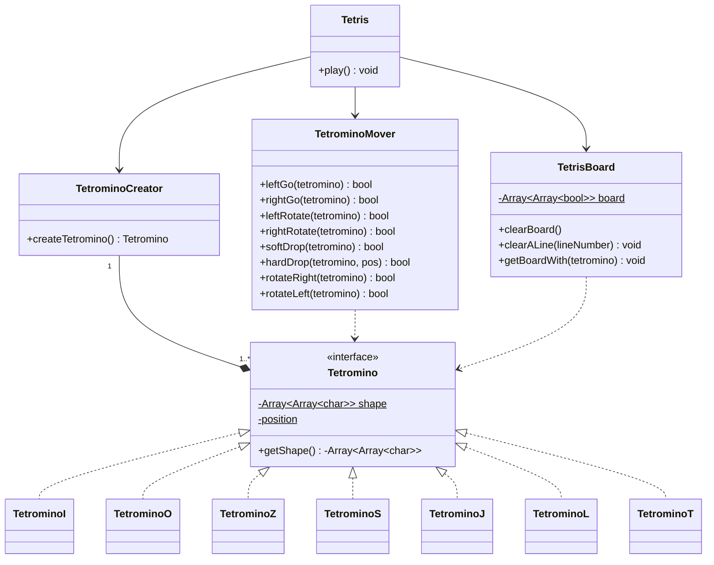

# UML documentation

## Class Diagram

```mermaid
    classDiagram
    class Tetris {
        +play() void
    }

    class TetrisBoard {
        -Array~Array~bool~~ board$
        +clearBoard()
        +clearALine(lineNumber) void
        +getBoardWith(tetromino) void
    }

    class TetrominoCreator {
        +createTetromino() Tetromino
    }

    class TetrominoMover {
        +leftGo(tetromino) bool
        +rightGo(tetromino) bool
        +leftRotate(tetromino) bool
        +rightRotate(tetromino) bool
        +softDrop(tetromino) bool
        +hardDrop(tetromino, pos) bool
        +rotateRight(tetromino) bool
        +rotateLeft(tetromino) bool
    }

    class Tetromino {
        <<interface>>
        -Array~Array~char~~ shape$
        -position$
        +getShape() -Array~Array~char~~
    }
    class TetrominoI
    class TetrominoO
    class TetrominoZ
    class TetrominoS
    class TetrominoJ
    class TetrominoL
    class TetrominoT

%% -- Lines --
    Tetris --> TetrisBoard
    Tetris --> TetrominoCreator
    Tetris --> TetrominoMover
    TetrominoCreator "1" --* "1..*" Tetromino
    TetrominoMover ..> Tetromino
    TetrisBoard ..> Tetromino
    Tetromino <|.. TetrominoI
    Tetromino <|.. TetrominoO
    Tetromino <|.. TetrominoZ
    Tetromino <|.. TetrominoS
    Tetromino <|.. TetrominoJ
    Tetromino <|.. TetrominoL
    Tetromino <|.. TetrominoT

```