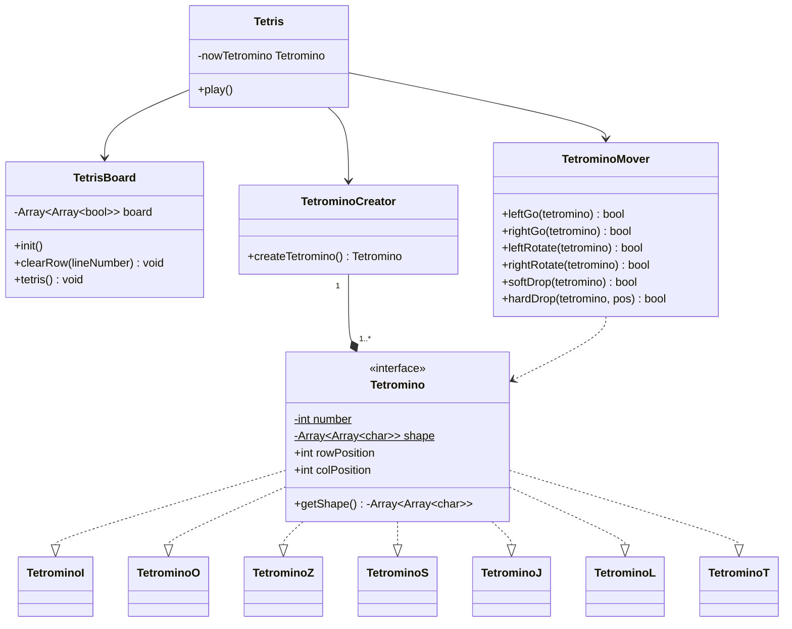

# UML documentation

## Class Diagram

```mermaid
    classDiagram
    class Tetris {
        -nowTetromino Tetromino
        +play()
    }

    class TetrisBoard {
        -Array~Array~bool~~ board
        +init()
        +clearRow(lineNumber) void
        +tetris() void
    }

    class TetrominoCreator {
        +createTetromino() Tetromino
    }

    class TetrominoMover {
        +leftGo(tetromino) bool
        +rightGo(tetromino) bool
        +leftRotate(tetromino) bool
        +rightRotate(tetromino) bool
        +softDrop(tetromino) bool
        +hardDrop(tetromino, pos) bool
    }

    class Tetromino {
        <<interface>>
        -int number$
        -Array~Array~char~~ shape$
        +int rowPosition
        +int colPosition
        +getShape() -Array~Array~char~~
    }
    class TetrominoI
    class TetrominoO
    class TetrominoZ
    class TetrominoS
    class TetrominoJ
    class TetrominoL
    class TetrominoT

%% -- Lines --
    Tetris --> TetrisBoard
    Tetris --> TetrominoCreator
    Tetris --> TetrominoMover
    TetrominoCreator "1" --* "1..*" Tetromino
    TetrominoMover ..> Tetromino
    Tetromino ..|> TetrominoI
    Tetromino ..|> TetrominoO
    Tetromino ..|> TetrominoZ
    Tetromino ..|> TetrominoS
    Tetromino ..|> TetrominoJ
    Tetromino ..|> TetrominoL
    Tetromino ..|> TetrominoT

```