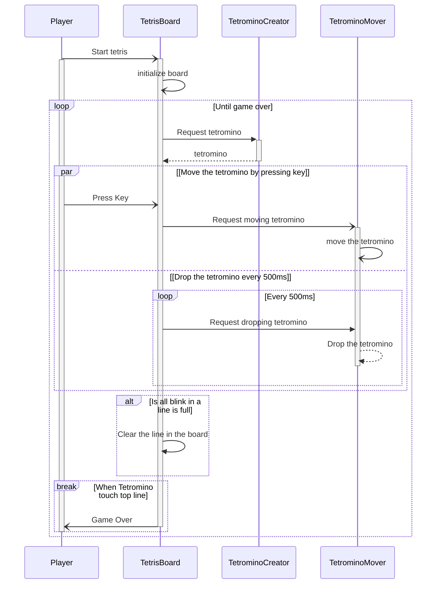

# UML documentation
## Sequence Diagram

```mermaid
sequenceDiagram
    Player -) +TetrisBoard: Start tetris
    activate Player
    TetrisBoard -) TetrisBoard: initialize board
    
    loop Until game over
        TetrisBoard ->> +TetrominoCreator: Request tetromino
        TetrominoCreator -->> -TetrisBoard: tetromino

        par [Move the tetromino by pressing key]
            Player -) TetrisBoard : Press Key
            TetrisBoard -) +TetrominoMover : Request moving tetromino
            TetrominoMover -) TetrominoMover : move the tetromino
        and [Drop the tetromino every 500ms]
            loop Every 500ms
                TetrisBoard ->> TetrominoMover: Request dropping tetromino
                TetrominoMover -->> -TetrominoMover: Drop the tetromino
            end
        end

        alt Is all blink in a line is full
            TetrisBoard ->> TetrisBoard: Clear the line in the board
        end
        
        break When Tetromino touch top line
            TetrisBoard -) -Player: Game Over
        end
        deactivate Player
    end
    
    
        
```