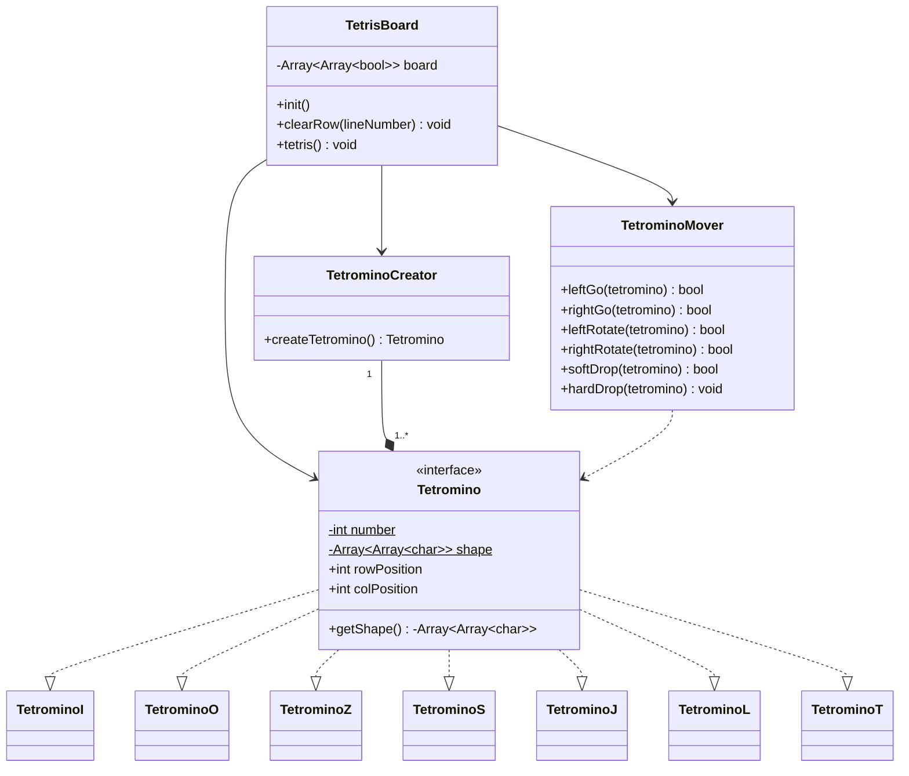

# UML documentation
## Class Diagram

```mermaid
    classDiagram
        class TetrisBoard {
            -Array~Array~bool~~ board
            +init()
            +clearRow(lineNumber) void
            +tetris() void
        }

        class TetrominoCreator {
            +createTetromino() Tetromino
        }
        
        class TetrominoMover {
            +leftGo(tetromino) bool
            +rightGo(tetromino) bool
            +leftRotate(tetromino) bool
            +rightRotate(tetromino) bool
            +softDrop(tetromino) bool
            +hardDrop(tetromino) void
        }
        
        class Tetromino {
            <<interface>>
            -int number$
            -Array~Array~char~~ shape$
            +int rowPosition
            +int colPosition
            +getShape() -Array~Array~char~~
        }
        class TetrominoI
        class TetrominoO
        class TetrominoZ
        class TetrominoS
        class TetrominoJ
        class TetrominoL
        class TetrominoT
        
        %% -- Lines --
        TetrisBoard --> Tetromino
        TetrisBoard --> TetrominoCreator
        TetrisBoard --> TetrominoMover
        
        TetrominoCreator "1"--*"1..*" Tetromino
        
        TetrominoMover ..> Tetromino 
        
        Tetromino ..|> TetrominoI
        Tetromino ..|> TetrominoO
        Tetromino ..|> TetrominoZ
        Tetromino ..|> TetrominoS
        Tetromino ..|> TetrominoJ
        Tetromino ..|> TetrominoL
        Tetromino ..|> TetrominoT
        
```