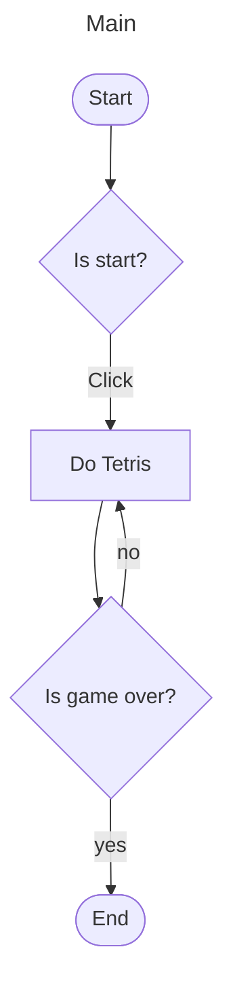
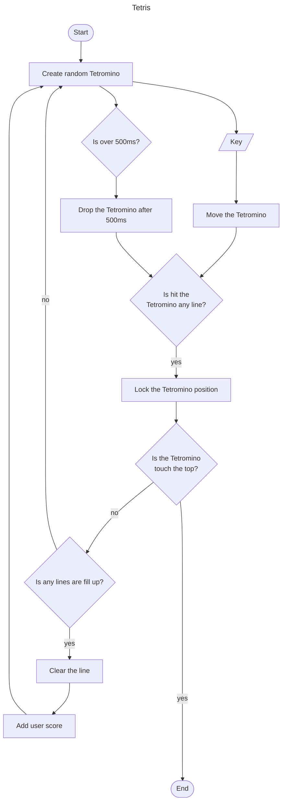

# UML documentation
## Flow Chart
### General Flow Chart

```mermaid
---
title: Main
---
    flowchart TD
    Start([Start]) --> StartBtn{Is start?}
        StartBtn -->|Click| Tetris[Do Tetris]
    Tetris --> Dead{Is game over?}
        Dead -->|yes| End([End])
        Dead -->|no| Tetris
```
### Detail Flow Chart

```mermaid
---
title: Tetris
---
    flowchart TD
    Start([Start]) --> CreateT[Create random Tetromino]
    CreateT --> PressKey[/Key/] & InspectTimeLimit{Is over 500ms?}
        InspectTimeLimit --> DropT[Drop the Tetromino after 500ms]
    PressKey --> MoveT[Move the Tetromino]
    
    MoveT & DropT --> InspectHitT{Is hit the 
                Tetromino any line?}
        InspectHitT -->|yes| LockT[Lock the Tetromino position]
        LockT --> Dead{Is the Tetromino
        touch the top?}
            Dead -->|no| Full{Is any lines are fill up?}
                Full -->|yes| Clear[Clear the line]
                    Clear --> Score[Add user score]
                    Score --> CreateT
                Full -->|no| CreateT
            Dead ------>|yes| End([End])
```
