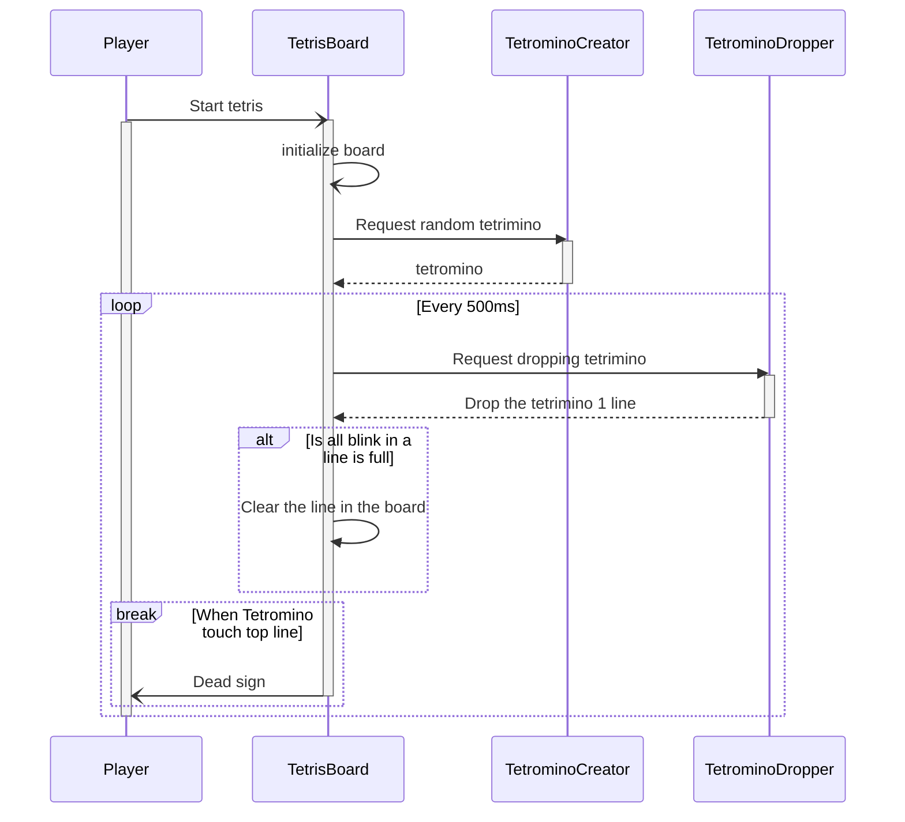

# UML documentation
## Sequence Diagram

```mermaid
sequenceDiagram
    Player -) TetrisBoard: Start tetris
    activate TetrisBoard
    activate Player
        TetrisBoard -) TetrisBoard: initialize board
        TetrisBoard ->> TetrominoCreator: Request random tetrimino
        activate TetrominoCreator
        TetrominoCreator -->> TetrisBoard: tetromino
        deactivate TetrominoCreator
        loop Every 500ms
            TetrisBoard ->> TetrominoDropper: Request dropping tetrimino
            
            activate TetrominoDropper
            TetrominoDropper -->> TetrisBoard: Drop the tetrimino 1 line
            deactivate TetrominoDropper
            
            alt Is all blink in a line is full
                TetrisBoard ->> TetrisBoard: Clear the line in the board
            end

            break When Tetromino touch top line
                TetrisBoard -) Player: Dead sign
                deactivate TetrisBoard
            end
        end
    deactivate Player
        
```